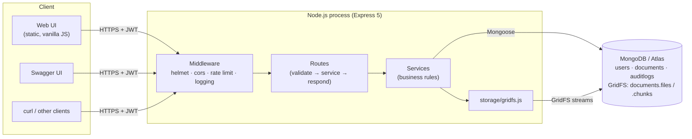
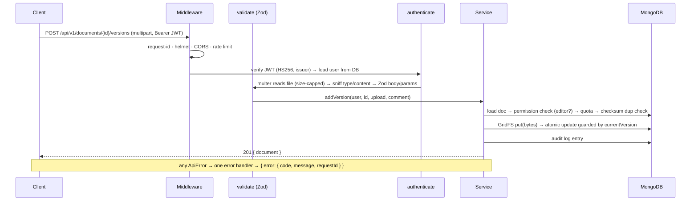
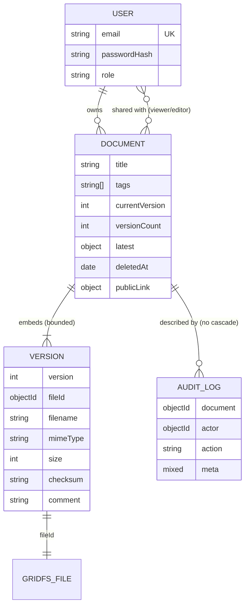
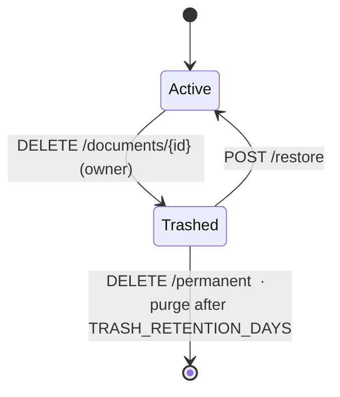

# Architecture & design decisions

This document explains **how Docucore works and why it is built this way**. Test IDs (e.g. `VER-08`) point to the
automated test that proves each claim — see [TEST_CASES.md](TEST_CASES.md).

- [1. System overview](#1-system-overview)
- [2. Request lifecycle](#2-request-lifecycle)
- [3. Data model](#3-data-model)
- [4. File storage (GridFS)](#4-file-storage-gridfs)
- [5. Authentication & authorisation](#5-authentication--authorisation)
- [6. Versioning](#6-versioning)
- [7. Trash & retention](#7-trash--retention)
- [8. Sharing & public links](#8-sharing--public-links)
- [9. Upload pipeline](#9-upload-pipeline)
- [10. Errors & observability](#10-errors--observability)
- [Security model](#security-model)
- [11. Capacity & limits](#11-capacity--limits)
- [12. Alternatives considered](#12-alternatives-considered)
- [13. What I would build next](#13-what-i-would-build-next)

## 1. System overview

One stateless Node process serves the REST API, the Swagger UI and the static web UI. All state lives in MongoDB:
metadata in normal collections, file bytes in GridFS.



**Layering rule:** routes never touch the database and services never touch `req`/`res`. That keeps business rules
(permissions, quota, versioning) testable and reusable — e.g. `bootstrap.js` creates the demo account by calling the same
`documentService.createDocument` the HTTP route uses.

## 2. Request lifecycle



Middleware order matters and is deliberate (`src/app.js`): request-id/logging first (so even rejected requests are
traceable), then Helmet/CORS, then body parsing with a 100 KB JSON limit, then `/health` and static files *before*
the API rate limiter (uptime pings must never be throttled), and the 404/error handlers last.

## 3. Data model



Key modelling choices:

| Decision | Why |
| --- | --- |
| **Versions embedded** in the document (not a separate collection) | A document’s version list is always read with it, is bounded by the retention policy (default 20), and one atomic update can push a version *and* bump the counters. |
| **`latest` denormalised** onto the document | Lists, filters (`mimeType`) and sorts (`size`) never need to open the `versions` array, and the list query excludes it (`-versions`) to stay small. |
| **`currentVersion` is monotonic**, `versionCount` is separate | Version numbers are never reused after pruning, so “v7” always means the same file. |
| **Audit log in its own collection, no cascade** | The trail must outlive the document it describes (`TRS-09`). |
| **Storage usage is aggregated, not a stored counter** | A counter can drift after a crash or a partial failure; a `$sum` over retained versions is always correct (`TRS-05`, `LIM-*`). |
| **Soft delete via `deletedAt`** | Trash is recoverable; a sparse index lets the purge job find expired items cheaply. |

Indexes: `{owner, deletedAt, updatedAt}` and `{sharedWith.user, deletedAt, updatedAt}` serve “my documents” and “shared
with me”; a sparse `{publicLink.tokenHash}` serves link lookup; `{email}` is unique on users (this — not a
“find-then-insert” check — is what makes duplicate registration race-free, `AUTH-03`).

## 4. File storage (GridFS)

Free hosts (Render, Koyeb…) run on an **ephemeral disk** that is wiped on every deploy and restart, and free object
storage usually needs a card. GridFS stores files as chunks *inside the same free Atlas database*, so the app stays
stateless and needs exactly one external service.

`src/storage/gridfs.js` is the **only** module that knows this: it exposes `put`, `openDownloadStream`, `remove`.
Moving to S3/R2 means re-implementing those three functions.

Consistency rules (because Mongo has no cross-collection transaction here):

- **Create:** write the blob first, then the document. If the document insert fails, delete the blob (no orphan).
- **Add version:** blob first, then a *guarded* atomic update. If the guard fails (a concurrent upload won), delete the blob (`VER-08` asserts no orphaned files remain).
- **Permanent delete:** delete the **record first, then the blobs**. A crash in between leaves harmless unreferenced blobs, never a record pointing at missing bytes. If a blob is somehow missing anyway, the download returns a clean `404 FILE_MISSING` JSON error instead of a corrupted response (`VER-10`).
- **Downloads are streamed** from GridFS to the response (no buffering) and the stream is destroyed if the client disconnects.

## 5. Authentication & authorisation

**Authentication.** `POST /auth/login` returns a JWT (HS256, `iss=docucore`, 8 h). Verification pins the algorithm
(so `alg: none` and other-secret tokens fail — `AUTH-11`) and then **loads the user from the database on every
request**. That one indexed lookup means role changes and account deletion take effect immediately instead of at token
expiry (`AUTH-12`, `AUTH-14`) — the usual weakness of purely stateless JWTs.

Login compares against a dummy bcrypt hash when the email is unknown, so unknown-user and wrong-password responses are
identical in both content and timing (`AUTH-07`).

**Authorisation** is centralised in `documentService.loadDocument(id, user, {need})`:

| Action | viewer | editor | owner |
| --- | :-: | :-: | :-: |
| Read metadata, list versions, download | ✅ | ✅ | ✅ |
| Edit title/description/tags, upload a version, read activity | ❌ 403 | ✅ | ✅ |
| Trash, restore, delete permanently | ❌ 403 | ❌ 403 | ✅ |
| Share / unshare, manage public link | ❌ 403 | ❌ 403 | ✅ |

- **No access at all → `404`, not `403`.** Returning 403 would confirm that a document exists; every document route uses the same helper, so this is uniform (`SHR-08`, `DOC-20`, `VER-11`).
- **Administrators have no implicit read access to other users’ documents** (`ADM-05`). Admin endpoints are operational only (stats, account list with usage, purge). This is a deliberate privacy stance.
- Trashed documents are visible to their owner only; collaborators lose sight of them until restore (`TRS-02`).

## 6. Versioning

- Each upload is an **immutable version** with filename, MIME type, size, SHA-256 checksum, comment, uploader.
- **Duplicate guard:** a file whose checksum equals the current version is rejected with `409 DUPLICATE_VERSION`, so accidental double-uploads don’t create noise (`VER-06`).
- **Optimistic concurrency:** the version is added with `findOneAndUpdate({_id, currentVersion: seen}, {$push, $set, $inc})`.
  If another writer got there first the filter matches nothing → the loser deletes its blob and returns `409 CONCURRENT_MODIFICATION`. Five simultaneous uploads therefore yield unique, gap-free numbers and zero orphaned files (`VER-08`). No locks, no transactions needed.
- **Retention:** after each successful add, versions beyond `MAX_VERSIONS_PER_DOCUMENT` are pruned oldest-first (record then blob), and the pruning is audited (`VER-07`). This bounds storage growth per document — important with a 512 MB free database.

## 7. Trash & retention



- Permanent deletion is only allowed **from the trash** — a two-step safety net against a single wrong click/request (`TRS-04`).
- Trashed files still count toward the owner’s quota until purged, so trash can’t be used to dodge limits (`TRS-05`).
- The purge runs every 6 h inside the process **and** can be triggered by `POST /admin/purge-trash`. Because free hosts sleep, the in-process timer is best-effort; the admin endpoint (or any external cron) closes the gap (`TRS-08`).

## 8. Sharing & public links

- **People:** the owner shares by email with `viewer` or `editor`. Re-sharing updates the permission (no duplicates, `SHR-04`). Only the owner sees the share list; collaborators just see their own permission (`SHR-01`).
- **Public links:** the token is 32 random bytes (256 bits, base64url). **Only its SHA-256 is stored**, so a database leak doesn’t leak working links, and the token is displayed exactly once (`SHR-21`). Links expire (1 h – 30 d → `410 LINK_EXPIRED`, `SHR-22`), can be revoked (`SHR-23`), are replaced when re-created (`SHR-24`), stop working while the document is trashed (`SHR-25`) and always serve the *newest* version (`SHR-26`). Anonymous downloads are audited (`SHR-29`).

## 9. Upload pipeline

```
multipart body ─▶ multer (memory, size cap, 1 file, field-size caps)
   ─▶ sanitize filename (strip paths/control chars, fix UTF-8)
   ─▶ resolve MIME (declared type must be allow-listed; octet-stream → by extension)
   ─▶ magic-number check (bytes must match the type; text must be valid UTF-8 without NULs)
   ─▶ quota check ─▶ SHA-256 ─▶ GridFS ─▶ metadata
```

- **Allow-list, not block-list:** PDF, PNG/JPEG/GIF/WebP, ZIP, Word/Excel/PowerPoint (old + OOXML), TXT/MD/CSV/JSON. HTML, SVG, JavaScript and executables are excluded because they are the vectors for stored XSS (`DOC-04`, `UT-FT-16`).
- **Never trust the client’s Content-Type:** an `.exe` renamed `invoice.pdf` is rejected (`DOC-05`).
- **Safe delivery:** downloads are always `Content-Disposition: attachment` with the verified type and `X-Content-Type-Options: nosniff`, so an upload can never execute in the site’s origin (`VER-03`). Non-ASCII names use RFC 5987 encoding (`VER-09`).
- **Why memory buffering:** files are capped (default 10 MB, 5 MB on the free deploy), which keeps peak memory predictable on a 512 MB instance and makes content sniffing and checksumming trivial. The trade-off (no multi-GB files) is documented; streaming into GridFS while hashing is the natural next step.

## 10. Errors & observability

- **One error shape** everywhere: `{ error: { code, message, details?, requestId } }`. Services throw `ApiError` with a stable machine-readable `code`; a single error handler also translates multer, body-parser, Mongoose cast/validation/duplicate-key errors (`src/middleware/error.js`).
- **Unknown errors** become a generic `500 INTERNAL_ERROR` — the real error goes to the log with the same `requestId`, and nothing internal (connection strings, stack) reaches the client (`SYS-06`).
- **Request IDs:** every response carries `X-Request-Id`; a client-supplied one is honoured only if it is short and boring (`SYS-04`).
- **Logs:** one JSON line per request via pino (headers redacted; `/health` excluded so uptime pings don’t drown real traffic).
- **`/health`** pings MongoDB and returns `503` when it is down (`SYS-01/02`). That single URL serves as a liveness probe, readiness probe **and** the keep-alive target that stops both Render sleeping and Atlas pausing (see [DEPLOYMENT.md](DEPLOYMENT.md)).
- **Graceful shutdown:** on `SIGTERM` (sent on every deploy) the server stops accepting connections, lets in-flight requests finish, closes MongoDB, and force-exits after 10 s.

## Security model

| Threat | Mitigation | Proven by |
| --- | --- | --- |
| NoSQL injection (`{"$ne":null}`) | Zod requires strings; Express 5’s query parser never builds operator objects | `AUTH-05` `UT-VAL-03` `DOC-28` |
| Regex injection / ReDoS via search | Input regex-escaped before use | `DOC-26` `UT-UTL-01` |
| Stored XSS / malware via upload | Allow-list + magic bytes; attachment + `nosniff`; UI renders with `textContent` only | `DOC-04/05` `VER-03` `UT-FT-16` |
| Path traversal in filenames | Path segments and control characters stripped | `DOC-09` `UT-FT-12` |
| IDOR / broken access control | Central permission check; 404 for no access; admins have no document access | `SHR-02/03/08` `VER-11` `ADM-05` |
| User enumeration at login | Same message + constant-time-ish compare | `AUTH-07` |
| Brute force / abuse | 20 auth attempts and 300 requests per 15 min per IP | `SYS-10/11` |
| JWT forgery / `alg:none` / stale role | Algorithm + issuer pinned; user reloaded each request | `AUTH-11/12/14` |
| Credential storage | bcrypt (cost 12), hash never serialised | `AUTH-08` |
| Public link leakage | 256-bit token, hash-only storage, expiry, revocation | `SHR-21..25` |
| Resource exhaustion | File-size cap, per-user quota, JSON body cap, version retention | `LIM-01..06` `VER-07` |
| Race conditions on versions | Optimistic concurrency guard | `VER-08` |
| Information leakage in errors | Generic 500, request-id correlation | `SYS-06` |
| Clickjacking, MIME sniffing, weak CSP | Helmet defaults + strict CSP; no inline scripts/handlers in the UI | `SYS-05` |
| Cross-origin abuse | CORS closed by default, allow-list via `CORS_ORIGINS` | `SYS-07` |

Accepted trade-offs (documented, not hidden): registration reveals whether an email is already taken (a normal UX
trade-off, mitigated by rate limiting); the UI keeps the JWT in `localStorage` (mitigated by the strict CSP and by never
using `innerHTML`; httpOnly cookies would add CSRF handling); there is no antivirus scan on uploads.

## 11. Capacity & limits

Sized for the free tiers it targets, and configurable via environment variables.

| Resource | Limit | Why |
| --- | --- | --- |
| Atlas M0 storage | 512 MB total (files + metadata) | Free-tier cap → per-user quota (default 50 MB; 25 MB in `render.yaml`) and version retention |
| Render free instance | 512 MB RAM, sleeps after 15 min idle | Memory-buffered uploads capped at 5–10 MB; keep-alive optional |
| Upload size | `MAX_FILE_SIZE_MB` (10; 5 on Render) | Predictable memory |
| Versions | newest 20 kept | Bounded growth |
| API rate | 300 / 15 min / IP; 20 auth / 15 min / IP | Abuse protection on a public demo |

Scaling out later: state is entirely in MongoDB, so extra instances work as-is; the only per-instance state is the
in-memory rate-limit counters (swap in a shared store) and the purge timer (harmless if it runs twice).

## 12. Alternatives considered

| Choice | Alternative | Why not |
| --- | --- | --- |
| MongoDB + GridFS | PostgreSQL + S3 | Two vendors, and Render’s free Postgres expires after 30 days — incompatible with “free for life”. Atlas M0 has no expiry. |
| Local disk uploads | – | Ephemeral on free hosts; files would vanish on each deploy. |
| Embedded versions | Separate `versions` collection | Extra query/join for every document read, and no atomic push-and-bump. Retention keeps the array small. |
| Express 5 | Fastify / Nest | Express 5 handles async errors natively now and is the most widely recognised; the layering (routes → services → storage) keeps the framework swappable. |
| Zod at the edge | Joi / express-validator | One schema language for env config, request bodies and queries, with strong type coercion. |
| Vanilla JS UI | React/Vite | No build step to deploy or maintain; the UI is intentionally small (the API is the product). |
| Hand-written OpenAPI | swagger-jsdoc annotations | Single readable contract file, validated in CI by a test (`SYS-20`), no comment-drift. |
| Regex substring search | `$text` / Atlas Search | Predictable for partial words (“inv” → “Invoice”); the seam to upgrade is one function (`listDocuments`). |

## 13. What I would build next

Streaming uploads (hash while piping to GridFS) and larger limits · refresh tokens with revocation · email flows
(verification, password reset, share notifications) · full-text search of file contents (Atlas Search) · antivirus
scanning (ClamAV) · S3/R2 storage behind the same interface · shared rate-limit store · an org/team model on top of
per-document sharing.
