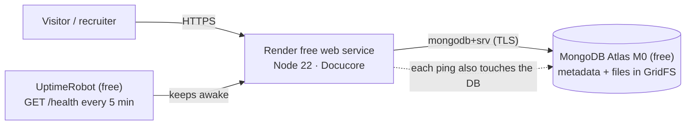

# Deploying Docucore for free (Render + MongoDB Atlas)

**Result:** a public HTTPS URL serving the web UI (`/`), Swagger docs (`/api-docs`) and the API — with **no credit card
and no expiry date on either free tier**. Total time: about 20 minutes.



- [Is it really free for life? (honest answer)](#is-it-really-free-for-life)
- [Step 1 — MongoDB Atlas](#step-1--mongodb-atlas-free-m0-cluster)
- [Step 2 — Push the code to GitHub](#step-2--push-the-code-to-github)
- [Step 3 — Deploy on Render](#step-3--deploy-on-render)
- [Step 4 — Verify](#step-4--verify)
- [Step 5 — Keep it awake](#step-5--keep-it-awake-and-the-database-active)
- [Step 6 — Before you share the link](#step-6--before-you-share-the-link)
- [Backups](#backups) · [Other hosts / Docker](#other-hosts-docker) · [Troubleshooting](#troubleshooting)

---

## Is it really free for life?

**No provider can promise “lifetime”** — free tiers are marketing decisions that can change. What you *can* do is
depend only on tiers that have **no built-in expiry**, and keep the app portable so a move costs an hour, not a rewrite.
That is exactly how this project is built.

| Component | What the free tier gives (checked Sept 2026) | Expiry? | What to know |
| --- | --- | --- | --- |
| **Render web service** (Free) | 750 instance-hours per workspace per month · 512 MB RAM · 0.1 CPU · sleeps after 15 min idle, ~1 min to wake | None stated | 750 h ≥ one always-on service (24 × 31 = 744 h). **Two** always-on free services would exceed it and get suspended until next month. |
| **MongoDB Atlas M0** | 512 MB storage · shared CPU/RAM | None | **Auto-paused after 30 days without activity** (emailed 7 days before); resumable. The keep-alive below prevents it. |
| ~~Render free PostgreSQL~~ | 1 GB | **Deleted 30 days after creation** | ❌ Deliberately **not used** — this is why the app stores everything in MongoDB/GridFS. |

Sources: [Render — Deploy for Free](https://render.com/docs/free) · [Render — platforms with a real free tier](https://render.com/articles/platforms-with-a-real-free-tier-for-developers-in-2026) · [Atlas — free cluster limits](https://www.mongodb.com/docs/atlas/reference/free-shared-limitations/) · [Atlas — pause/resume](https://www.mongodb.com/docs/atlas/pause-terminate-cluster/). Re-check them before relying on any figure; they are the vendors’ to change.

**Your safety net:** the app is a plain Node process configured by environment variables (plus a `Dockerfile`), and the
data can be exported with `mongodump` ([Backups](#backups)). If a free tier ever disappears you can move to another host
without changing code.

---

## Step 1 — MongoDB Atlas (free M0 cluster)

1. Sign up at <https://www.mongodb.com/cloud/atlas> and create a project.
2. **Create a cluster → choose the free tier (M0)**. Pick a region close to your Render region
   (Render **Oregon** pairs well with Atlas **AWS / Oregon (us-west-2)**).
3. **Database Access → Add New Database User**: username + a **strong generated password** (avoid `@ : / ?` or
   URL-encode them). Give it *Read and write to any database* (or scope it to `docucore`). Save the password.
4. **Network Access → Add IP Address → Allow access from anywhere (`0.0.0.0/0`)**.
   Render’s free instances don’t have fixed outbound IPs, so an allow-list isn’t possible; access is still protected by TLS
   plus your database user’s password.
5. **Connect → Drivers → Node.js** and copy the connection string, then **add the database name** before the `?`:

   ```
   mongodb+srv://<user>:<password>@cluster0.xxxxx.mongodb.net/docucore?retryWrites=true&w=majority
   ```

   Keep this string secret — it is your `MONGODB_URI`.

## Step 2 — Push the code to GitHub

```bash
cd docucore
git init && git add . && git commit -m "Docucore: document management API"
git branch -M main
git remote add origin https://github.com/<you>/docucore.git
git push -u origin main
```

`.env` is git-ignored — never commit secrets. (The CI workflow in `.github/workflows/ci.yml` starts running tests on push.)

## Step 3 — Deploy on Render

### Option A — Blueprint (recommended, uses `render.yaml`)

1. <https://dashboard.render.com> → sign in with GitHub → **New + → Blueprint** → select your repo.
2. Render reads [`render.yaml`](../render.yaml), shows a **Free** web service, and asks for the secret values:
   - `MONGODB_URI` — the Atlas string from Step 1
   - `ADMIN_EMAIL` / `ADMIN_PASSWORD` — your administrator login (optional but useful for `/admin/*`)
   - `DEMO_PASSWORD` — password for the public demo account `demo@docucore.dev` (it is shown to visitors, so make it
     unique to this project)
3. **Apply**. `JWT_SECRET` is generated automatically. First build takes 1–3 minutes.

### Option B — Manual web service

New + → **Web Service** → your repo, then:

| Setting | Value |
| --- | --- |
| Runtime | Node |
| Build command | `npm ci --omit=dev` |
| Start command | `node src/server.js` |
| Instance type | **Free** |
| Health check path | `/health` |

Environment variables:

| Key | Value |
| --- | --- |
| `NODE_VERSION` | `22` |
| `NODE_ENV` | `production` |
| `MONGODB_URI` | your Atlas string |
| `JWT_SECRET` | 48+ random chars (`node -e "console.log(require('crypto').randomBytes(48).toString('hex'))"`) |
| `USER_QUOTA_MB` / `MAX_FILE_SIZE_MB` | `25` / `5` — Atlas M0 is 512 MB **total**, so keep quotas modest on a public demo |
| `ADMIN_EMAIL`, `ADMIN_PASSWORD`, `DEMO_EMAIL`, `DEMO_PASSWORD` | optional (see above) |

> The server refuses to start in production without a `JWT_SECRET` of at least 32 characters — that is intentional.

## Step 4 — Verify

Open these on your Render URL (the very first request after a sleep can take up to a minute):

| URL | Expected |
| --- | --- |
| `/health` | `{"status":"ok","db":"up",…}` — proves the app **and** Atlas are connected |
| `/` | Login page; **Try the demo account** shows sample documents |
| `/api-docs` | Swagger UI — `POST /auth/login`, click **Authorize**, try `GET /documents` |

Then upload a file in the UI and check Atlas → **Browse Collections**: you should see `users`, `documents`,
`auditlogs`, `documents.files`, `documents.chunks`. Render → **Logs** shows one JSON line per request with its `requestId`.

## Step 5 — Keep it awake (and the database active)

Render’s free instance sleeps after 15 minutes without traffic, and Atlas M0 pauses after 30 days without activity.
Both are solved by one cheap request: **`GET /health` pings MongoDB**, so a monitor hitting it every few minutes keeps the
service warm *and* counts as database activity.

**Primary — UptimeRobot (free):**
1. Create an account at <https://uptimerobot.com> → **Add New Monitor**.
2. Type **HTTP(s)**, URL `https://<your-service>.onrender.com/health`, interval **5 minutes** (the free plan’s shortest
   interval at the time of writing — check the current plan).
3. Bonus: you get an uptime history and email alerts.

**Secondary — GitHub Action (already in the repo):** in your GitHub repo go to *Settings → Secrets and variables →
Actions → Variables* and add `APP_URL = https://<your-service>.onrender.com`. `.github/workflows/keepalive.yml` then pings
every 10 minutes. Caveat: GitHub disables scheduled workflows after 60 days without repository activity and its cron
timing is best-effort — so treat it as a backup, not the primary.

**Or do nothing:** the app works fine asleep; the UI shows a “server may take up to a minute to wake up” message. For a
portfolio, keeping it warm is worth the two minutes of setup so a reviewer never waits.

> ⚠️ Free-hour budgeting: 750 h/month covers **one** always-on service. If your Render workspace has other free web
> services that are also kept awake, their hours add up and Render suspends them until the next month.

## Step 6 — Before you share the link

- [ ] `DEMO_PASSWORD` and `ADMIN_PASSWORD` are unique, strong, and not reused elsewhere
- [ ] `.env` was never committed (`git log --all -- .env` shows nothing)
- [ ] Don’t rotate `JWT_SECRET` casually — it signs in every user (rotating logs everyone out, which is fine if intended)
- [ ] Update the live-demo URL in `README.md`
- [ ] `MAX_FILE_SIZE_MB` / `USER_QUOTA_MB` are small enough that a few visitors can’t fill the 512 MB database
- [ ] (Optional) Delete stray test accounts/files from the Atlas UI or via the admin endpoints

---

## Backups

Free Atlas clusters don’t include the scheduled cloud backups of paid tiers (see the
[limits page](https://www.mongodb.com/docs/atlas/reference/free-shared-limitations/)), so take your own — it’s one command
with the [MongoDB Database Tools](https://www.mongodb.com/docs/database-tools/installation/installation/):

```bash
# export everything (metadata + GridFS files) to one compressed archive
mongodump --uri "$MONGODB_URI" --gzip --archive=docucore-$(date +%F).gz

# restore into any MongoDB (Atlas, local, Docker)
mongorestore --uri "$NEW_MONGODB_URI" --gzip --archive=docucore-2026-09-18.gz
```

Run it monthly (a calendar reminder is enough for a portfolio). This is also your **exit plan**: dump, point
`MONGODB_URI` at a new database, and you are migrated.

## Other hosts / Docker

The repo ships a small production [`Dockerfile`](../Dockerfile) (Node 22 Alpine, non-root, healthcheck). Any container
host works:

```bash
docker build -t docucore .
docker run -p 3000:3000 \
  -e NODE_ENV=production \
  -e JWT_SECRET=$(node -e "console.log(require('crypto').randomBytes(48).toString('hex'))") \
  -e MONGODB_URI='mongodb+srv://…/docucore?retryWrites=true&w=majority' \
  docucore
```

> Note: the Docker image build is exercised by the CI workflow (`docker` job); it was not built in the environment this
> project was authored in, but the production dependency set and start-up path it relies on were run and verified there.

Same environment variables everywhere (see the README table). Hosts with a comparable free option include
[Koyeb](https://www.koyeb.com) (Docker or Git deploy); check each provider’s *current* free terms before choosing.

## Alternative: Vercel

Render is the recommended path above — it's what this project is built and tested around, and it has no request-body
size cap or execution-time limit to design around. **Vercel works too**, but only because the app is adapted for it:
Vercel runs Node apps as **serverless functions**, not a long-running process, which this app's default shape
(`src/server.js`) is not. That adaptation lives in [`api/index.js`](../api/index.js) and [`vercel.json`](../vercel.json)
— read the comments in `api/index.js` for exactly what it does differently. Know the trade-offs before choosing this
path:

| | Render (recommended) | Vercel |
| --- | --- | --- |
| Request body / upload size | up to `MAX_FILE_SIZE_MB` (set to whatever you configure) | **hard-capped by the platform** at a few MB for serverless functions — check [Vercel's current limits](https://vercel.com/docs/functions/limitations) and set `MAX_FILE_SIZE_MB` comfortably under it (e.g. `4`) |
| Execution time per request | none (long-lived process) | capped per plan; `vercel.json` requests `maxDuration: 30`, but your plan may cap it lower — check current limits |
| MongoDB connections | one persistent connection | one pool **per warm container**, possibly several concurrently; `maxPoolSize` is kept small automatically (see `src/config/db.js`) to protect Atlas M0's 500-connection cap, but a traffic spike could still exhaust it |
| Background trash purge | in-process timer (`src/server.js`) | no persistent process to host a timer — instead `GET /api/v1/internal/purge-trash`, guarded by a shared secret, triggered by Vercel Cron Jobs (plan-dependent — see below) or the bundled GitHub Actions fallback |
| Cold starts | Free instance sleeps after 15 min idle (~1 min to wake) | Functions cold-start too; typically faster, but state (like the cached DB connection) resets every cold start |

**Setup:**

1. Do Step 1 (MongoDB Atlas) exactly as above.
2. Push the repo to GitHub (Step 2).
3. In the [Vercel dashboard](https://vercel.com/new), import the repo. Vercel auto-detects `api/index.js` as a
   serverless function via `vercel.json`; no build command is needed for this project.
4. Set environment variables (Project → Settings → Environment Variables):

   | Key | Value |
   | --- | --- |
   | `MONGODB_URI` | your Atlas connection string |
   | `JWT_SECRET` | 48+ random chars |
   | `CRON_SECRET` | 32+ random chars — enables `GET /api/v1/internal/purge-trash` (leave unset and it stays disabled, returning 503) |
   | `MAX_FILE_SIZE_MB` | `4` (stay safely under Vercel's request-body cap — see the table above) |
   | `ADMIN_EMAIL` / `ADMIN_PASSWORD`, `DEMO_EMAIL` / `DEMO_PASSWORD` | optional, same as Render |

5. Deploy. Verify the same way as Step 4 above (`/health`, `/`, `/api-docs`) on your `*.vercel.app` URL.
6. **Trash purge scheduling** — pick one (or both, it's idempotent):
   - Vercel Cron Jobs: `vercel.json` already declares one (`0 3 * * *`, daily). Availability and minimum interval
     depend on your Vercel plan — check [Vercel's current Cron Jobs limits](https://vercel.com/docs/cron-jobs/usage-and-pricing).
   - GitHub Actions fallback (works on any plan): [`.github/workflows/vercel-purge-trash.yml`](../.github/workflows/vercel-purge-trash.yml)
     — set the `APP_URL` repo variable and `CRON_SECRET` repo secret as the workflow comments describe.

**What I verified without a real Vercel account:** `api/index.js` invoked directly as Vercel invokes it — a raw
`(req, res)` handler, `NODE_ENV=production`, `VERCEL=1` — serving the UI, Swagger, a full register → upload → download
flow, the cron endpoint (correct/incorrect secret), 15 concurrent requests against one shared connection, and a
simulated database outage returning a clean `503` instead of crashing the invocation. **What I could not verify from
here:** an actual Vercel deployment — the real cold-start/concurrency behavior of their platform, whether
`includeFiles: "public/**"` correctly bundles the whole `public/` directory (which now includes `openapi.yaml`) into the function (locally those files are just
present on disk regardless, so this specific step is untested), and Vercel Cron Jobs actually firing. Confirm these
after your first deploy.

## Troubleshooting

| Symptom | Likely cause → fix |
| --- | --- |
| Deploy logs: `MongooseServerSelectionError` / `Failed to start` | Atlas **Network Access** doesn’t allow `0.0.0.0/0`; wrong user/password (special characters must be URL-encoded); the cluster is paused (Atlas → **Resume**). |
| `Invalid environment configuration` or `JWT_SECRET must be set…` | A required variable is missing/too short in Render → Environment. |
| First page load takes 30–60 s | Free instance was asleep (cold start). Set up the keep-alive (Step 5). |
| `/health` returns 503 `{"db":"down"}` | App is up but can’t reach Atlas — same causes as the first row. |
| Uploads fail with 413 | File over `MAX_FILE_SIZE_MB` or user over `USER_QUOTA_MB` (`FILE_TOO_LARGE` / `QUOTA_EXCEEDED` in the error `code`). |
| 429 `RATE_LIMITED` | 20 login/register attempts or 300 requests per 15 min per IP; wait, or raise the limits in `src/config/env.js`. |
| Service “suspended” mid-month | Free instance-hours (750/month per workspace) exhausted — usually another free service in the same workspace. |
| A user reports an error | Ask for the `requestId` in the error JSON and search it in Render → Logs. |
| Vercel: `Invalid export found in module "api/index.js"` | You're on an older version of this repo — `api/index.js` must default-export a `(req, res)` function (it does now; redeploy from `main`). |
| Vercel: uploads fail with a platform-level 413 (not our JSON error) | Over Vercel's request-body cap, not `MAX_FILE_SIZE_MB` — lower `MAX_FILE_SIZE_MB` further, the file was rejected before reaching our code. |
| Vercel: `/api/v1/internal/purge-trash` returns 503 `CRON_NOT_CONFIGURED` | `CRON_SECRET` isn't set in Vercel's environment variables. |
| Vercel: trash never gets purged automatically | Check whether your plan actually runs the `vercel.json` cron (see the Vercel section above), or set up the GitHub Actions fallback. |
